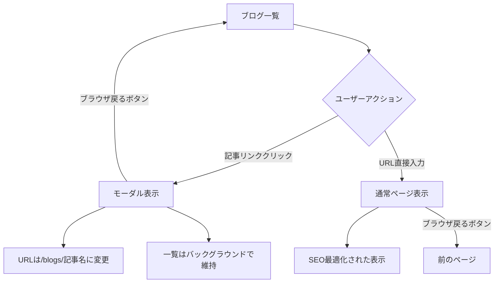
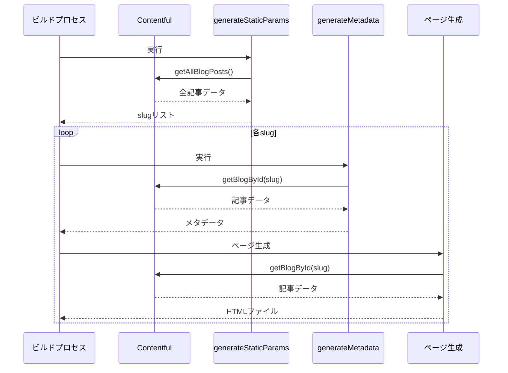
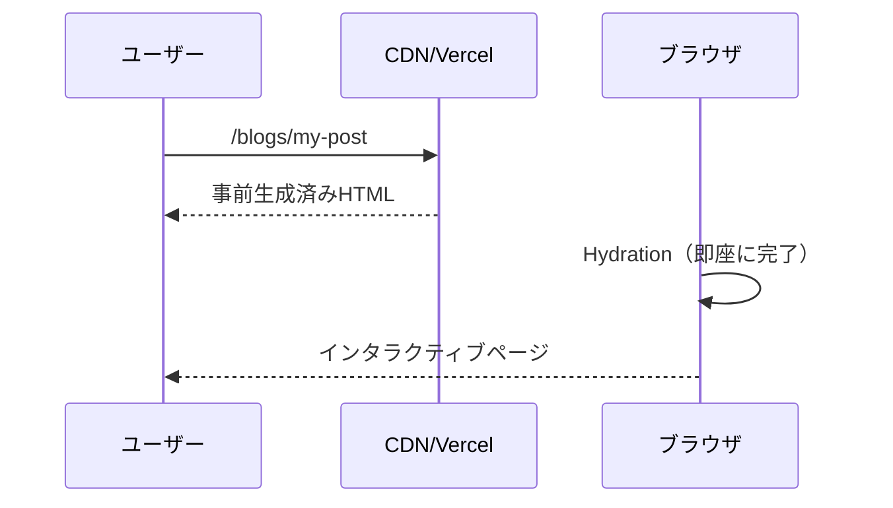

# 📘 Project Specification: Portfolio & Blog Site

## 0. Overview

本プロジェクトは、Next.js App RouterのParallel RoutesとIntercepting Routesを活用して、ブログ詳細をモーダル表示するシステムを実装しています。SSG（静的サイト生成）とメタデータ最適化により、UXとSEOを両立した構成を実現しています。

---

## 1. 技術スタック

| 項目           | 技術                         | バージョン       |
| -------------- | ---------------------------- | ---------------- |
| フレームワーク | Next.js                      | 14+ (App Router) |
| レンダリング   | SSG (Static Site Generation) | -                |
| データソース   | Contentful CMS, microCMS     | -                |
| スタイリング   | CSS Modules                  | -                |
| 日付処理       | Day.js                       | -                |
| Markdown       | React Markdown + remark-gfm  | -                |

---

## 2. アーキテクチャ概要

### レイアウト構成

```
┌─────────────────────────────────────┐
│              Layout                 │
├─────────────────┬───────────────────┤
│    @main        │    右カラム       │
│   (左カラム)     │  (共通ナビ等)     │
│                 │                   │
│  ブログ一覧     │                   │
│  または         │                   │
│  詳細ページ     │                   │
│                 │                   │
└─────────────────┴───────────────────┘
│              @modal                 │
│         (モーダルオーバーレイ)      │
│            ブログ詳細               │
└─────────────────────────────────────┘
```

```
src/app/
├── layout.tsx                    # ルートレイアウト
├── @main/                        # メインスロット
│   ├── default.tsx              # デフォルトページ（ブログ一覧）
│   └── blogs/
│       ├── page.tsx             # ブログ一覧ページ
│       └── components/          # ブログ一覧コンポーネント
└── @modal/                       # モーダルスロット
    ├── default.tsx              # デフォルト（空表示）
    ├── (.)blogs/[slug]/         # Intercepting Routes
    │   ├── page.tsx             # モーダル詳細ページ
    │   └── components/
    │       └── blog-content/    # 共通ブログ詳細コンポーネント
    └── blogs/[slug]/            # 通常ルート（直接アクセス用）
        └── page.tsx             # 通常詳細ページ
```

## ルーティングの仕組み

### 設計思想

本プロジェクトでは、**一つのURLで複数の表示パターンを実現する**ことを目標としています。同じ `/blogs/my-post` というURLでも、アクセス方法によって異なるUI体験を提供します。

### 採用した技術とその理由

#### 1. Parallel Routes（並列ルート）

**目的**: 同一画面内で複数のページコンポーネントを同時に表示

- **左カラム**: ブログ一覧やナビゲーション（@mainスロット）
- **右カラム**: 共通UI要素（childrenスロット）
- **オーバーレイ**: モーダル表示（@modalスロット）

**メリット**: レイアウトの状態を維持しながら、部分的にコンテンツを更新できる

#### 2. Intercepting Routes（インターセプトルート）

**目的**: 同一URLで表示方法を動的に切り替え

| アクセス方法   | 表示形式     | ユーザー体験                     |
| -------------- | ------------ | -------------------------------- |
| ページ内リンク | モーダル表示 | スムーズな遷移、コンテキスト維持 |
| 直接URL        | 通常ページ   | SEO対応、シェア可能              |
| ブラウザ戻る   | 一覧に復帰   | 自然なナビゲーション             |

**メリット**: URLの一意性を保ちながら、UXに応じた最適な表示を実現

### なぜこの仕組みにしたのか

#### 1. **UXの最適化**

- **モーダル表示**: 一覧ページのコンテキストを失わずに詳細確認
- **通常表示**: SEOフレンドリーで共有しやすいURL
- **スムーズ遷移**: ページ全体の再読み込みなしで内容切り替え

#### 2. **SEOとの両立**

- **単一URL**: 検索エンジンにとって理解しやすい構造
- **静的生成**: 事前生成されたHTMLで確実にインデックス
- **メタデータ**: 各記事固有の最適化情報

#### 3. **開発・保守性**

- **コンポーネント共通化**: モーダルと通常表示で同一コンポーネント利用
- **ルーティング自動化**: Next.jsの規約に従った直感的な構造
- **型安全性**: TypeScriptによる堅牢な実装

### 実現される体験



この仕組みにより、**ユーザーはストレスなく記事を閲覧**でき、**開発者は保守しやすい構造**を維持し、**検索エンジンは適切にコンテンツを理解**できる、三方良しの設計を実現しています。

## SSG（静的サイト生成）実装

### 1. generateStaticParams

```typescript
export async function generateStaticParams(): Promise<Array<{ slug: string }>> {
  const posts = await getAllBlogPosts()
  return posts.map((post) => ({
    slug: post.fields.slug,
  }))
}
```

**実行タイミング**: ビルド時  
**目的**: 全ブログ記事のslugを列挙し、静的ページを事前生成

### 2. 静的生成設定

```typescript
export const dynamic = 'force-static'
export const revalidate = false
```

**効果**:

- ビルド時に全ページを静的生成
- ランタイムでのサーバー処理なし
- CDNキャッシュによる高速配信

### 3. 両ルートでの実装

| ファイル                          | 機能                | SSG対応 |
| --------------------------------- | ------------------- | ------- |
| `@modal/(.)blogs/[slug]/page.tsx` | Intercepting Routes | ✅      |
| `@modal/blogs/[slug]/page.tsx`    | 通常ルート          | ✅      |

## メタデータ最適化

### generateMetadata実装

```typescript
export async function generateMetadata({ params }: Props): Promise<Metadata> {
  const { blog } = await getBlogById(slug)

  return {
    title: blog.fields.title,
    description: blog.fields.description,
    openGraph: {
      title: `${blog.fields.title} | andmohiko.dev`,
      type: 'article',
      publishedTime: blog.fields.publishedAt,
      images: [
        /* ヘッダー画像 */
      ],
    },
    twitter: {
      card: 'summary_large_image',
      title: `${blog.fields.title} | andmohiko.dev`,
      description: blog.fields.description,
    },
  }
}
```

### SEO最適化効果

✅ **個別最適化**: 各記事固有のタイトル・説明  
✅ **ソーシャル対応**: Open Graph、Twitter Card  
✅ **検索エンジン**: 適切なメタデータ設定  
✅ **パフォーマンス**: ビルド時生成によるゼロランタイム

## データフロー

### ビルド時



### ランタイム



## パフォーマンス特性

### 1. ビルド時最適化

- **事前生成**: 全ページをビルド時に静的生成
- **ゼロランタイム**: サーバー処理なしで配信
- **CDNキャッシュ**: 静的アセットとして効率配信

### 2. UX最適化

- **瞬時表示**: 事前生成によるゼロ読み込み時間
- **スムーズ遷移**: Intercepting Routesによるモーダル表示
- **Back/Forward**: ブラウザ履歴との自然な連携

### 3. SEO最適化

- **完全なメタデータ**: 各記事固有の最適化情報
- **クローラー対応**: 静的HTMLによる確実なインデックス
- **ソーシャル最適化**: リッチなカード表示
