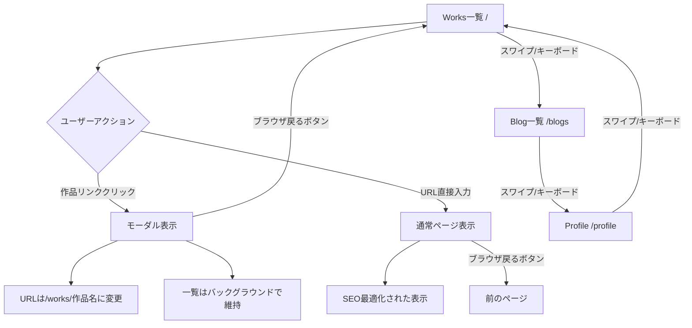
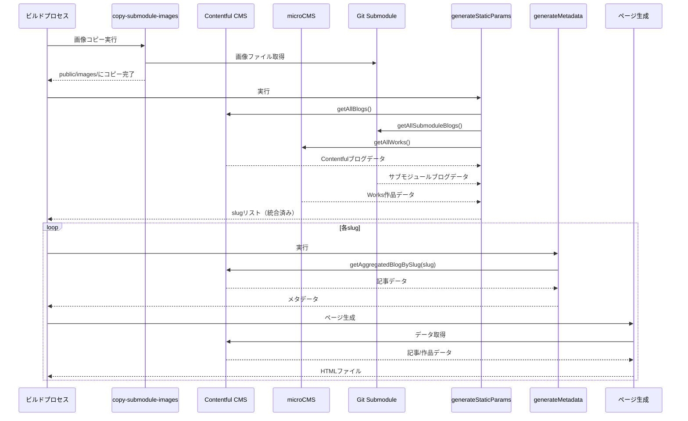
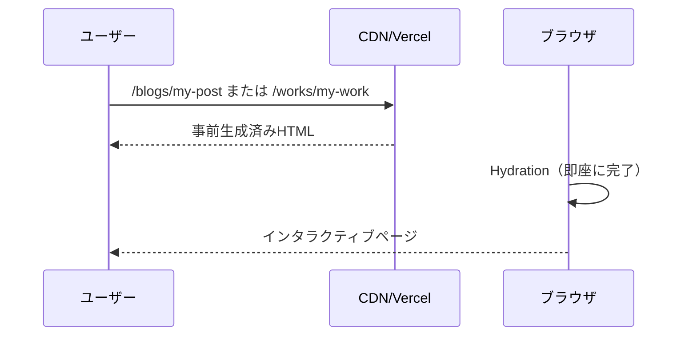

# 📘 Project Specification: Portfolio & Blog Site

## 0. Overview

本プロジェクトは、Next.js App RouterのParallel RoutesとIntercepting Routesを活用して、ポートフォリオサイトを実装しています。プロフィール、作品、ブログの3つのセクションで構成され、作品とブログの詳細をモーダル表示するシステムを実装しています。SSG（静的サイト生成）とメタデータ最適化により、UXとSEOを両立した構成を実現しています。

---

## 1. 技術スタック

| 項目           | 技術                                                         | バージョン       |
| -------------- | ------------------------------------------------------------ | ---------------- |
| フレームワーク | Next.js                                                      | 15+ (App Router) |
| レンダリング   | SSG (Static Site Generation)                                 | -                |
| データソース   | Contentful CMS, microCMS, Git Submodule (Markdown)           | -                |
| スタイリング   | CSS Modules                                                  | -                |
| 日付処理       | Day.js                                                       | -                |
| Markdown       | React Markdown + remark-gfm + rehype-raw + rehype-sanitize   | -                |
| アイコン       | React Icons                                                  | -                |

---

## 2. アーキテクチャ概要

### サイト構成

本サイトは以下の3つの主要セクションで構成されています:

1. **Profile** (`/profile`): プロフィールと人生年表
2. **Works** (`/`): 制作物ポートフォリオ（ルートページ）
3. **Blog** (`/blogs`): 技術ブログ

各セクションはスワイプ・キーボード操作でナビゲート可能です。

### レイアウト構成

```
┌─────────────────────────────────────────────────┐
│              Layout                             │
├─────────────────┬───────────────────────────────┤
│    @main        │    右カラム (RightColumn)     │
│   (左カラム)     │                               │
│ LeftColumn      │  - ナビゲーション             │
│                 │  - @modal スロット            │
│  - children     │    (モーダル詳細表示)         │
│  - Profile      │                               │
│  - Works一覧    │                               │
│  - Blog一覧     │                               │
└─────────────────┴───────────────────────────────┘
```

### ディレクトリ構成

```
src/app/
├── layout.tsx                    # ルートレイアウト
├── page.tsx                      # ルートページ (空のプレースホルダー)
├── @main/                        # メインスロット (左カラム)
│   ├── page.tsx                 # Worksページ (ルート表示)
│   ├── profile/
│   │   ├── page.tsx             # プロフィールページ
│   │   └── components/          # プロフィール関連コンポーネント
│   ├── works/
│   │   └── page.tsx             # Worksページへのリダイレクト
│   └── blogs/
│       ├── page.tsx             # ブログ一覧ページ
│       └── components/          # ブログ一覧コンポーネント
└── @modal/                       # モーダルスロット (右カラム)
    ├── default.tsx              # デフォルト（空表示）
    ├── (.)works/[slug]/         # Works Intercepting Routes
    │   ├── page.tsx             # モーダル詳細ページ
    │   └── components/
    │       └── work-content/    # 共通Works詳細コンポーネント
    ├── works/[slug]/            # Works通常ルート
    │   └── page.tsx             # 通常詳細ページ
    ├── (.)blogs/[slug]/         # Blog Intercepting Routes
    │   ├── page.tsx             # モーダル詳細ページ
    │   └── components/
    │       └── blog-content/    # 共通ブログ詳細コンポーネント
    └── blogs/[slug]/            # Blog通常ルート
        └── page.tsx             # 通常詳細ページ
```

## 3. ルーティングの仕組み

### 設計思想

本プロジェクトでは、**一つのURLで複数の表示パターンを実現する**ことを目標としています。同じ `/blogs/my-post` や `/works/my-work` というURLでも、アクセス方法によって異なるUI体験を提供します。

### 採用した技術とその理由

#### 1. Parallel Routes（並列ルート）

**目的**: 同一画面内で複数のページコンポーネントを同時に表示

- **左カラム**: Profile、Works一覧、Blog一覧（@mainスロット + children）
- **右カラム**: ナビゲーション + モーダル表示（@modalスロット）

**メリット**: レイアウトの状態を維持しながら、部分的にコンテンツを更新できる

#### 2. Intercepting Routes（インターセプトルート）

**目的**: 同一URLで表示方法を動的に切り替え

| アクセス方法   | 表示形式     | ユーザー体験                     |
| -------------- | ------------ | -------------------------------- |
| ページ内リンク | モーダル表示 | スムーズな遷移、コンテキスト維持 |
| 直接URL        | 通常ページ   | SEO対応、シェア可能              |
| ブラウザ戻る   | 一覧に復帰   | 自然なナビゲーション             |

**適用対象**: Worksページ、Blogページの詳細表示

**メリット**: URLの一意性を保ちながら、UXに応じた最適な表示を実現

### なぜこの仕組みにしたのか

#### 1. **UXの最適化**

- **モーダル表示**: 一覧ページのコンテキストを失わずに詳細確認
- **通常表示**: SEOフレンドリーで共有しやすいURL
- **スムーズ遷移**: ページ全体の再読み込みなしで内容切り替え
- **スワイプナビゲーション**: Profile → Works → Blog の循環的な遷移

#### 2. **SEOとの両立**

- **単一URL**: 検索エンジンにとって理解しやすい構造
- **静的生成**: 事前生成されたHTMLで確実にインデックス
- **メタデータ**: 各記事・作品固有の最適化情報

#### 3. **開発・保守性**

- **コンポーネント共通化**: モーダルと通常表示で同一コンポーネント利用
- **ルーティング自動化**: Next.jsの規約に従った直感的な構造
- **型安全性**: TypeScriptによる堅牢な実装

### 実現される体験


```mermaid
graph TD
    A[Works一覧 /] --> B{ユーザーアクション}

    B -->|作品リンククリック| C[モーダル表示]
    C --> D[URLは/works/作品名に変更]
    C --> E[一覧はバックグラウンドで維持]

    B -->|URL直接入力| F[通常ページ表示]
    F --> G[SEO最適化された表示]

    C -->|ブラウザ戻るボタン| A
    F -->|ブラウザ戻るボタン| H[前のページ]

    A -->|スワイプ/キーボード| I[Blog一覧 /blogs]
    I -->|スワイプ/キーボード| J[Profile /profile]
    J -->|スワイプ/キーボード| A
```

この仕組みにより、**ユーザーはストレスなくコンテンツを閲覧**でき、**開発者は保守しやすい構造**を維持し、**検索エンジンは適切にコンテンツを理解**できる、三方良しの設計を実現しています。

## 4. データソースとブログ統合

### データソース構成

本プロジェクトは以下の3つのデータソースを使用しています:

1. **Contentful CMS**: 主要ブログ記事の管理
2. **microCMS**: Worksポートフォリオの管理
3. **Git Submodule (Markdown)**: 外部リポジトリのブログ記事

### ブログ統合システム

`lib/blog-aggregator.ts` において、複数のデータソースからブログ記事を統合:

```typescript
export async function getAllAggregatedBlogs(): Promise<AggregatedBlog[]> {
  // Contentfulブログ + Gitサブモジュールブログを統合
  const contentfulBlogs = await getAllBlogs()
  const submoduleBlogs = await getAllSubmoduleBlogs()

  return [...contentfulBlogs, ...submoduleBlogs]
    .sort((a, b) => new Date(b.publishedAt) - new Date(a.publishedAt))
}
```

### 画像処理

サブモジュールブログの画像は、ビルド時に `public/images/submodule-blogs/` にコピーされます:

- スクリプト: `scripts/copy-submodule-images.ts`
- 実行タイミング: `pnpm dev` および `pnpm build` の前

## 5. SSG（静的サイト生成）実装

### 1. generateStaticParams

**Blogページの例**:

```typescript
export async function generateStaticParams(): Promise<Array<{ slug: string }>> {
  const aggregatedBlogs = await getAllAggregatedBlogs()
  const blogs = convertToBlogArray(aggregatedBlogs)

  return blogs
    .filter((blog) => blog.slug)
    .map((blog) => ({
      slug: blog.slug!,
    }))
}
```

**実行タイミング**: ビルド時
**目的**: 全ブログ記事・Works作品のslugを列挙し、静的ページを事前生成

### 2. 静的生成設定

```typescript
export const dynamic = 'force-static'
export const revalidate = false
```

**効果**:

- ビルド時に全ページを静的生成
- ランタイムでのサーバー処理なし
- CDNキャッシュによる高速配信

### 3. 両ルートでの実装

| ファイル                          | 機能                | SSG対応 |
| --------------------------------- | ------------------- | ------- |
| `@modal/(.)blogs/[slug]/page.tsx` | Intercepting Routes | ✅      |
| `@modal/blogs/[slug]/page.tsx`    | 通常ルート          | ✅      |
| `@modal/(.)works/[slug]/page.tsx` | Intercepting Routes | ✅      |
| `@modal/works/[slug]/page.tsx`    | 通常ルート          | ✅      |

## 6. メタデータ最適化

### generateMetadata実装

**Blogページの例**:

```typescript
export async function generateMetadata({ params }: Props): Promise<Metadata> {
  const resolvedParams = await params
  const slug = resolvedParams.slug

  const { blog } = await getAggregatedBlogBySlug(slug)

  const blogTitle = blog.title
  const blogDescription = blog.description
  const blogHeaderImageUrl = blog.headerImageUrl
  const blogPublishedAt = blog.publishedAt

  return {
    title: blogTitle,
    description: blogDescription,
    openGraph: {
      title: `${blogTitle} | andmohiko.dev`,
      description: blogDescription,
      type: 'article',
      publishedTime: blogPublishedAt,
      authors: ['andmohiko'],
      images: blogHeaderImageUrl
        ? [
            {
              url: blogHeaderImageUrl.startsWith('//')
                ? `https:${blogHeaderImageUrl}`
                : blogHeaderImageUrl,
              width: 1200,
              height: 630,
              alt: blogTitle,
            },
          ]
        : undefined,
    },
    twitter: {
      card: 'summary_large_image',
      title: `${blogTitle} | andmohiko.dev`,
      description: blogDescription,
      creator: '@andmohiko',
    },
  }
}
```

### SEO最適化効果

✅ **個別最適化**: 各記事・作品固有のタイトル・説明
✅ **ソーシャル対応**: Open Graph、Twitter Card
✅ **検索エンジン**: 適切なメタデータ設定
✅ **パフォーマンス**: ビルド時生成によるゼロランタイム

## 7. データフロー

### ビルド時


```mermaid
sequenceDiagram
    participant Build as ビルドプロセス
    participant Script as copy-submodule-images
    participant Contentful as Contentful CMS
    participant MicroCMS as microCMS
    participant Submodule as Git Submodule
    participant Gen as generateStaticParams
    participant Meta as generateMetadata
    participant Page as ページ生成

    Build->>Script: 画像コピー実行
    Script->>Submodule: 画像ファイル取得
    Script-->>Build: public/images/にコピー完了

    Build->>Gen: 実行
    Gen->>Contentful: getAllBlogs()
    Gen->>Submodule: getAllSubmoduleBlogs()
    Gen->>MicroCMS: getAllWorks()
    Contentful-->>Gen: Contentfulブログデータ
    Submodule-->>Gen: サブモジュールブログデータ
    MicroCMS-->>Gen: Works作品データ
    Gen-->>Build: slugリスト（統合済み）

    loop 各slug
        Build->>Meta: 実行
        Meta->>Contentful: getAggregatedBlogBySlug(slug)
        Contentful-->>Meta: 記事データ
        Meta-->>Build: メタデータ

        Build->>Page: ページ生成
        Page->>Contentful: データ取得
        Contentful-->>Page: 記事/作品データ
        Page-->>Build: HTMLファイル
    end
```

### ランタイム


```mermaid
sequenceDiagram
    participant User as ユーザー
    participant CDN as CDN/Vercel
    participant Browser as ブラウザ

    User->>CDN: /blogs/my-post または /works/my-work
    CDN-->>User: 事前生成済みHTML
    Browser->>Browser: Hydration（即座に完了）
    Browser-->>User: インタラクティブページ
```

## 8. パフォーマンス特性

### 1. ビルド時最適化

- **事前生成**: 全ページをビルド時に静的生成
- **ゼロランタイム**: サーバー処理なしで配信
- **CDNキャッシュ**: 静的アセットとして効率配信
- **画像最適化**: Next.js Image コンポーネントによる自動最適化

### 2. UX最適化

- **瞬時表示**: 事前生成によるゼロ読み込み時間
- **スムーズ遷移**: Intercepting Routesによるモーダル表示
- **Back/Forward**: ブラウザ履歴との自然な連携
- **スワイプナビゲーション**: セクション間のスムーズな移動

### 3. SEO最適化

- **完全なメタデータ**: 各記事・作品固有の最適化情報
- **クローラー対応**: 静的HTMLによる確実なインデックス
- **ソーシャル最適化**: リッチなOGP画像とTwitter Card表示
- **構造化データ**: 適切なセマンティックHTML

## 9. 主要機能

### ナビゲーション

- **ContentPaginator**: 各セクション間を循環的にナビゲート
  - Profile → Works → Blog → Profile
  - キーボードショートカット対応（矢印キー）
  - スワイプジェスチャー対応（モバイル）

### モーダル表示

- **ModalWrapper**: 詳細コンテンツのモーダル表示
  - Works詳細、Blog詳細に使用
  - 背景クリックで閉じる
  - ESCキーで閉じる
  - スクロール可能

### レイアウト

- **LeftColumn**: メインコンテンツ表示エリア
- **RightColumn**: ナビゲーションとモーダル表示エリア
- レスポンシブデザイン対応

## 10. 開発ワークフロー

### 開発サーバー起動

```bash
pnpm dev
```

1. サブモジュール画像を `public/images/` にコピー
2. Next.js開発サーバー起動（Turbopack使用）

### ビルド

```bash
pnpm build
```

1. サブモジュール画像をコピー
2. 静的サイト生成（SSG）
3. 最適化とバンドル

### 環境変数

必要な環境変数:

```
CONTENTFUL_SPACE_ID=xxx
CONTENTFUL_ACCESS_TOKEN=xxx
MICROCMS_SERVICE_DOMAIN=xxx
MICROCMS_API_KEY=xxx
NEXT_PUBLIC_GA_MEASUREMENT_ID=xxx
NEXT_PUBLIC_GOOGLE_SITE_VERIFICATION=xxx
```

## 11. まとめ

本プロジェクトは、Next.js 15のApp Routerの高度な機能を活用し、以下を実現しています:

- ✅ 3つのセクション（Profile、Works、Blog）を持つポートフォリオサイト
- ✅ 複数データソース（Contentful、microCMS、Git Submodule）の統合
- ✅ Parallel RoutesとIntercepting Routesによる最適なUX
- ✅ 完全なSSGによる高速なパフォーマンス
- ✅ SEOとソーシャルメディア最適化
- ✅ 型安全な実装とコンポーネント共通化による高い保守性
